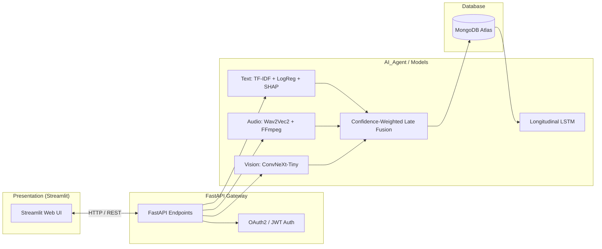

#  MindLens: Multimodal Mental Health Assessment & Forecasting Platform

MindLens is an end-to-end AI-powered multimodal platform engineered to deliver objective, non-invasive, real-time mental wellness assessments and longitudinal trend forecasting. 

By fusing signals across three distinct modalities—**linguistic semantics (Text)**, **acoustic prosody (Voice)**, and **facial micro-expressions (Vision)**—MindLens calculates a comprehensive mental health risk profile equipped with explainable AI (SHAP) and deep sequence modeling (LSTM).

---

##  Key Features

- **Multimodal AI Assessment:**
  - **Text Modality:** TF-IDF n-gram vectorization with Logistic Regression for fast, high-accuracy emotion & risk classification.
  - **Voice / Audio Modality:** Fine-tuned `Wav2Vec2` acoustic emotion recognition with automatic browser audio transcoding (mono 16kHz PCM WAV via FFmpeg).
  - **Vision Modality:** `ConvNeXt-Tiny` backbone with a custom linear softmax classification head for 7 facial emotions.
- **Explainable AI (SHAP):**
  - Integrated `SHAP LinearExplainer` to identify word-level attributions and feature importance driving predictions.
- **Confidence-Weighted Late Fusion:**
  - Robust to missing modalities (e.g. text-only, audio-only, or full fusion).
  - Fusion weights dynamically scaled by each model's prediction confidence.
- **Longitudinal Trend Forecasting:**
  - Stacked 2-Layer LSTM (`EmotionLSTM`) modeling 7-day sliding wellness trajectories.
  - Predicts future risk trajectories and tracks longitudinal history in MongoDB.
- **Secure Authentication:**
  - OAuth2 Password Bearer / JWT (HS256) auth.
  - **Auto-Login on Registration:** New users are automatically logged in upon signing up.
- **Modern Interactive Dashboard:**
  - Streamlit UI featuring interactive gauges, session history, and trend graphs.

---

##  System Architecture



---

##  Project Structure

```
mindlens/
├── AI_Agent/                  # Production ML model weights & preprocessors
│   ├── models/
│   │   ├── audio_model/       # Wav2Vec2 model files & preprocessor configs
│   │   ├── face_model/        # ConvNeXt-Tiny PyTorch weights (face_model.pt)
│   │   ├── text_model/        # TF-IDF vectorizer & Logistic Regression model
│   │   └── emotion_lstm.pth   # Pre-trained LSTM for trend forecasting
│   └── scaler.pkl             # Feature normalizer for LSTM sequence data
├── backend/                   # FastAPI application & business logic
│   ├── personalization/       # MongoDB storage & longitudinal LSTM forecasting
│   │   ├── history.py         # Session persistence and history retrieval
│   │   ├── mongo.py           # MongoDB client configuration
│   │   └── trend.py           # Future risk prediction with LSTM
│   ├── auth.py                # User signup, login, password hashing, and JWT tokens
│   ├── database.py            # MongoDB collections setup
│   └── main.py                # Primary FastAPI app, inference pipelines, and fusion logic
├── frontend/                  # Streamlit dashboard application
│   └── app.py                 # Multi-page interface with assessment, auth, & charts
├── datasets/                  # Datasets used for model exploration & training
│   └── text/                  # Text emotion & suicide detection CSV datasets
├── notebooks/                 # Model training & validation Jupyter notebooks
├── Dockerfile                 # Multi-stage production Docker container definition
├── docker-compose.yml         # Container orchestration (MongoDB + Backend + Frontend)
├── documentation.md           # Comprehensive technical specs and interview defense
├── requirements.txt           # Python dependency requirements
└── .env                       # Environment variables configuration
```

---

##  Prerequisites

- **Python 3.11+**
- **FFmpeg** (required for audio transcoding)
  - On macOS: `brew install ffmpeg`
  - On Ubuntu/Debian: `sudo apt-get install -y ffmpeg`
- **MongoDB Atlas** account or a local MongoDB instance


##  Running the Project Locally

### 1. Set Up Virtual Environment

```bash
cd /Users/muhammadnehal/Desktop/mindlens

# Create and activate virtual environment
python3 -m venv venv
source venv/bin/activate

# Install dependencies
pip install --upgrade pip
pip install -r requirements.txt
```

### 2. Start the Backend (Terminal 1)

```bash
source venv/bin/activate
uvicorn backend.main:app --reload --port 8000
```
- **FastAPI Documentation (Swagger):** [http://127.0.0.1:8000/docs](http://127.0.0.1:8000/docs)
- **Alternative Docs (ReDoc):** [http://127.0.0.1:8000/redoc](http://127.0.0.1:8000/redoc)

### 3. Start the Frontend (Terminal 2)

```bash
source venv/bin/activate
streamlit run frontend/app.py --server.port 8501
```
- **Streamlit Web Application:** [http://localhost:8501](http://localhost:8501)

### Quick One-Liner (Both in Background)

```bash
source venv/bin/activate
(uvicorn backend.main:app --port 8000 &) && streamlit run frontend/app.py --server.port 8501
```

---

## 🐳 Running with Docker Compose

If you have Docker installed, you can spin up the complete stack with a single command:

```bash
docker-compose up --build
```

- **Frontend:** [http://localhost:8501](http://localhost:8501)
- **Backend:** [http://localhost:8000/docs](http://localhost:8000/docs)
- **Local MongoDB:** `localhost:27017`

---

##  API Reference

All protected endpoints expect an `Authorization: Bearer <JWT_TOKEN>` header.

| Method | Endpoint | Description | Auth Required |
|---|---|---|---|
| `POST` | `/signup` | Register new user & automatically return JWT access token | No |
| `POST` | `/login` | Authenticate user credentials and return JWT access token | No |
| `GET` | `/me` | Retrieve authenticated user profile | Yes |
| `POST` | `/predict/text` | Text emotion classification and risk score | No |
| `POST` | `/explain/text` | SHAP word attribution values for text prediction | No |
| `POST` | `/predict/audio` | Audio file emotion recognition (`Wav2Vec2`) | No |
| `POST` | `/predict/face` | Facial emotion classification (`ConvNeXt-Tiny`) | No |
| `POST` | `/predict/fusion` | Confidence-weighted late fusion across text, audio, and face | Optional / Yes |
| `GET` | `/trend` | Longitudinal 7-day predicted future risk using LSTM | Yes |
| `GET` | `/mental-health-report` | Full assessment history, longitudinal status, and future risk | Yes |

---

## 🔬 Model Specifications

| Modality | Architecture / Algorithm | Output Dimensions | Primary Metric / Task |
|---|---|---|---|
| **Text** | TF-IDF + Logistic Regression | Binary / Multi-class | Risk Probability + SHAP Attribution |
| **Audio** | Wav2Vec2 Sequence Classification | Emotion Softmax + Confidence | Acoustic Emotion Recognition |
| **Vision** | ConvNeXt-Tiny (512-dim head + GELU) | 7 Emotion Classes | Facial Micro-expression Analysis |
| **Trend** | 2-Layer Stacked LSTM (Hidden: 64) | Continuous Future Risk | Longitudinal Trajectory Forecasting |

---

## 📄 License & Notes

MindLens is developed for educational and experimental healthcare informatics purposes. It is not intended as a substitute for clinical psychiatric evaluation.
